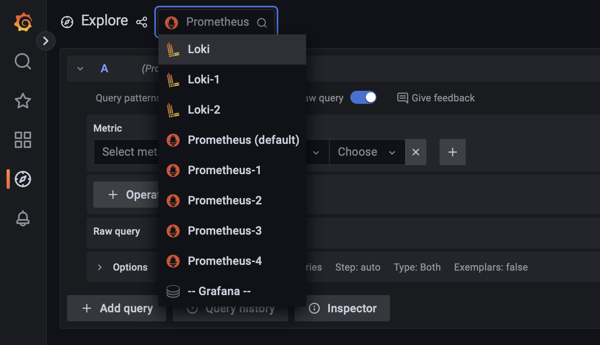

# nixtla

# What is OAuth

OAuth or Open Authorization is an authorization protocol that helps third-party application access to their resources without sharing their credentials but at the same time giving the necessary details to identify them.

Oauth works with the help of a token provided by the third-party application that can be used to get user details without entering a username or password.

A Client will send an authorization request to the resource owner or google in our case which in turn will grant us authorization. After sending the authorization grant to the Authorization server or google server it sends us an access token that can be used by the client to get protected resources such as username, id, and so on.

# How Does OAuth Code work

We generate a google client Id and a secret that can be used to use Google Oauth API. Just the code takes us to the normal public end point which displays a text.

/login creates auth url and tells oath.google the redirect url which is our auth url.

```
redirect_uri = request.url_for('auth')  # This creates the url for the /auth endpoint
```

The above line of code generates a redirect url.</br>

Here the user will be shown a set of his options email ids that he can use to login. The /auth url asks for the access token and sends it back to google to get the user details

```
access_token = await oauth.google.authorize_access_token(request)
```

the above line of code asks for the access token

/nixtla url takes this user object and displays the user name and an option to logout.

```
HTMLResponse(f'<p>Hello {name}!</p><a href=/logout>Logout</a>')
```

The above line of code displays the username that is extracted along with the logout option the redirects us to logout url

After clicking the logout option. The /logout will redirect you to the home page


# Monitoring

The monitoring architecture has three components. 

+ **Promtail**: Promtail agent scraps logs from the docker container and pushes these logs to Grafana Loki. The configuration for the promtail agent can be seen in the github repo.
+ **Loki**: Loki is a log aggregation system, which collects all the logs scrapped by the promtail agent, which will then be used by Grafana to visualize the logs. The configuration for Loki can be seen in the github repo.
+ **Grafana**: We use grafana to visualize these logs by using Loki as the data source for these logs. Its configuration can be seen in the github repo.

The sample API that we created has the **/login** endpoint which redirects to the OAuth service. The username from the OAuth service is used to log the activity for that particular user. This custom logging can be seen in the **/nixtla** endpoint in the run.py file in the github repo.

# Building the Docker Image

To build the docker image of the sample API, we run the Dockerfile as seen in the github repo. To push the container logs to loki, we need a docker plugin. To install it, do <br><br>
```docker plugin install grafana/loki-docker-driver:latest --alias loki --grant-all-permissions```<br><br>
Then build the docker image using<br><br>
```docker build -t initial-app .```<br><br>

And then, run the docker image using the command below.<br><br>

```
docker run --name demo \                             
  --log-driver=loki \
  --log-opt loki-url="http://localhost:3100/loki/api/v1/push" \
  -p 7000:7000 \
  -d initial-app-1
```

Then redirect to the image running in localhost at port 7000. When we try to login to the sample API, the container access logs are pushed to Loki, which is then visualized in Grafana. The Loki and Grafana instances are in the localhost as per the configuration files in the repo.<br>
To see the logs, Go to the explore tab and choose Loki as the data source.


